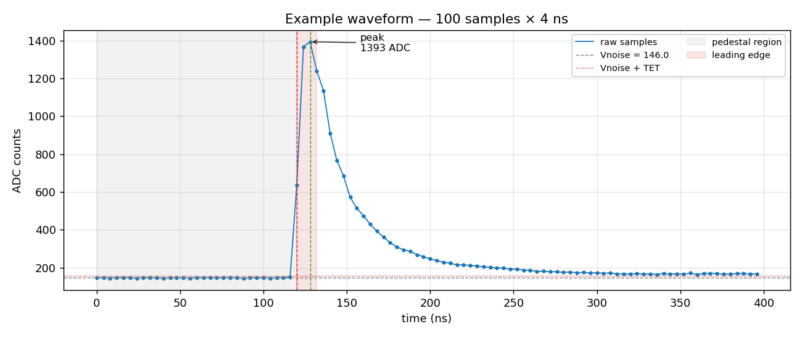
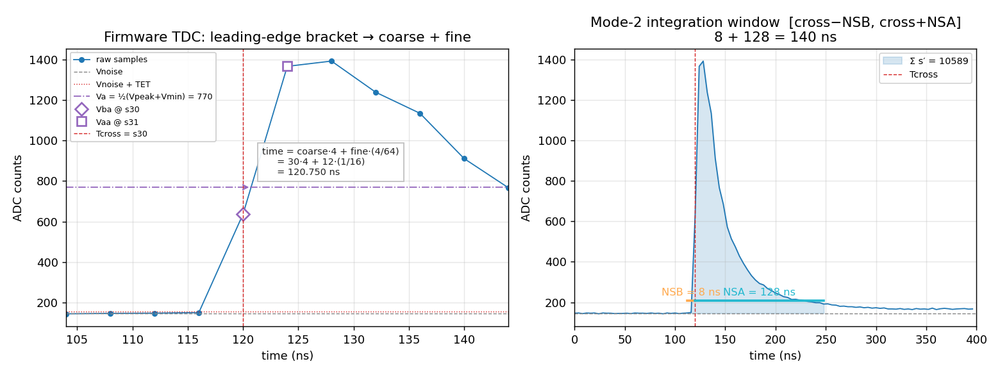
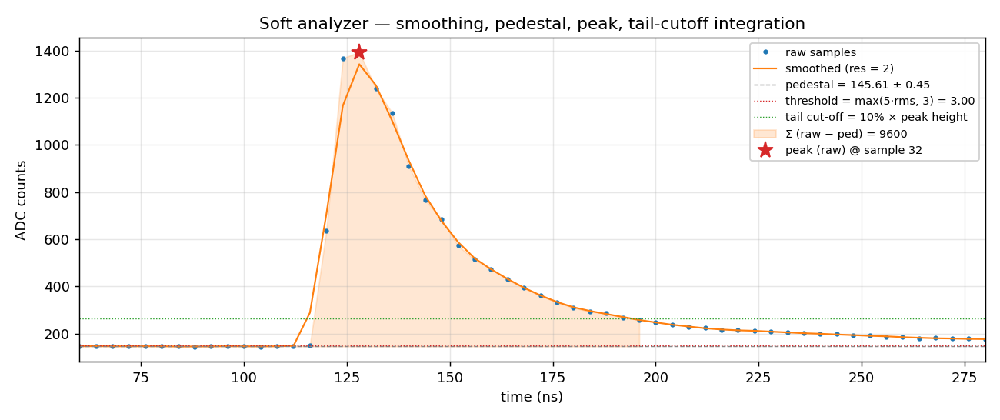

# Software Waveform Analysis in `prad2dec`

`prad2dec` ships **two** offline analyzers that run on raw FADC250 samples
(`uint16_t[nsamples]`, 4 ns/sample at 250 MHz):

| Analyzer | Class | Purpose |
|---|---|---|
| Soft | `fdec::WaveAnalyzer` (`WaveAnalyzer.{h,cpp}`) | Robust local-maxima peak finding for HyCal energy / time use. Tolerates noisy pedestals, finds multiple peaks per channel. |
| Firmware | `fdec::Fadc250FwAnalyzer` (`Fadc250FwAnalyzer.{h,cpp}`) | Bit-faithful emulation of the JLab FADC250 firmware Mode 1/2/3 (Hall-D V3 + NSAT/NPED/MAXPED extensions). Used to compare offline reconstruction against on-board firmware output. |

Both are stack-allocated, zero-heap on the hot path, and run side-by-side
when `prad2ana_replay_rawdata` is invoked with the `-p` flag (see
[`analysis/REPLAYED_DATA.md`](../../analysis/REPLAYED_DATA.md)).

The remainder of this note walks through both algorithms on a single
example pulse, with parameter values matching the real run config in
[`database/daq_config.json`](../../database/daq_config.json).

## Example waveform

100 samples × 4 ns. A short, bright pulse on top of a quiet ~146 ADC
baseline, followed by a long scintillation tail.



| feature | value |
|---|---|
| length | 100 samples = 400 ns |
| baseline | ≈ 146 ADC (samples 0..29) |
| pulse onset | sample 30 (t = 120 ns) |
| peak | sample 32, 1393 ADC |
| rise time | 8 ns (cross → peak) |
| tail | slow exponential decay, still ~20 ADC above baseline at sample 99 |

This is representative of a HyCal PbWO₄ signal: a fast leading edge
(~10 ns) followed by a long PMT/scintillator tail.

## Firmware emulator — `Fadc250FwAnalyzer`

The firmware analyzer reproduces the on-board pipeline so we can compare
offline analysis against firmware-reported values without re-running the
DAQ. The full algorithm spec lives in
[`docs/clas_fadc/FADC250_algorithms.md`](../clas_fadc/FADC250_algorithms.md);
this section is a parameter-by-parameter walk-through.

### Parameters

Parameters live under the `fadc250_firmware` block in `daq_config.json`.
**`NSB` and `NSA` are in nanoseconds**, floored to whole 4 ns samples
inside the analyzer; everything else is unitless or in ADC counts.

| field | unit | role |
|---|---|---|
| `TET` | ADC counts | Trigger Energy Threshold above pedestal. A pulse is rejected if `Vpeak − Vmin ≤ TET`. |
| `NSB` | ns | Window before threshold crossing (Mode 2 integral). Floored to whole samples (`NSB / CLK_NS`). |
| `NSA` | ns | Window after threshold crossing. Same flooring as `NSB`. |
| `NPEAK` (= `MAX_PULSES`) | — | Max pulses kept per channel per readout window (1..4). |
| `NSAT` | samples | Consecutive-above-TET requirement after Tcross — rejects single-sample spikes. `NSAT=1` reproduces the legacy Mode 3 single-sample crossing. |
| `NPED` | samples | Number of leading samples summed for the `Vnoise` estimate. |
| `MAXPED` | ADC counts | Online outlier-rejection threshold: pedsub samples whose deviation exceeds `MAXPED` are dropped from the `Vnoise` sum. `0` disables. |
| `CLK_NS` | ns | Sample period (4 ns at 250 MHz). |

Run-config defaults (current `daq_config.json`):

```json
"TET": 10.0, "NSB": 8, "NSA": 128, "NPEAK": 1,
"NSAT": 4, "NPED": 3, "MAXPED": 1, "CLK_NS": 4.0
```

### Pipeline

Step-by-step, applied to the example waveform:

**1. Pedestal estimate (`Vnoise`).** Mean of the first `NPED = 3` samples
with `MAXPED = 1` outlier filter (drop any sample whose deviation from the
running mean exceeds 1 ADC). For our trace: `(146+147+144)/3 = 145.67`,
sample 1 (147) is filtered, refined mean = `145.0`.

**2. Pulse search.** `Vmin = Vnoise`. Walk the buffer starting at sample
`NPED`. The first pulse is detected as soon as a sample exceeds `Vnoise`
and walks monotonically up to a local maximum.

**3. Acceptance.** `Vpeak = 1393`. The pedestal-subtracted height is
`Vpeak − Vmin = 1247 ≫ TET = 10` → accepted.

**4. Tcross.** First leading-edge sample whose pedsub value exceeds `TET`:
sample 30, since `637 − 146 = 491 > 10`.

**5. NSAT gate.** `NSAT = 4` → samples 30, 31, 32, 33 must all be > TET.
They are (491, 1221, 1247, 1093) → accepted. With `NSAT = 1`, this gate is
a no-op.

**6. TDC — `Va`, bracket, fine time.**

```
Va  = Vmin + (Vpeak − Vmin) / 2
    = 146 + (1393 − 146) / 2
    = 769.5
```

Find the bracket on the rising edge: smallest `k` with `s[k] ≥ Va`. Here
`s[30] = 637 < 769.5`, `s[31] = 1367 ≥ 769.5` → `k = 31`. So
`Vba = s[30] = 637`, `Vaa = s[31] = 1367`. Fine time:

```
fine = round( (Va − Vba) / (Vaa − Vba) × 64 )
     = round( (769.5 − 637) / (1367 − 637) × 64 )
     = round( 0.1815 × 64 ) = 12

coarse     = k − 1 = 30
time_units = coarse·64 + fine = 1932    (LSB = 62.5 ps)
time_ns    = time_units × CLK_NS / 64 = 120.75 ns
```

Visually (`fig2`, left panel): the dot-dash `Va` line crosses the rising
edge between the diamond `Vba` and the square `Vaa` markers. The fine-time
arrow points from the `Vba` sample to the interpolated zero-crossing.

**7. Mode-2 integral.** Window `[cross − NSB_s, cross + NSA_s]` where
`NSB_s = NSB/4 = 2`, `NSA_s = NSA/4 = 32`. So `[28, 62]`, i.e. 35 samples
= 140 ns. The integrand is the pedestal-subtracted waveform `s′ = max(0,
s − Vnoise)`.

```
Σ s′[28..62] = 10589  (pedsub ADC·sample)
```

The shaded band in `fig2` (right panel) is exactly this sum.



**8. Quality bitmask.** `0x00` = `Q_GOOD`. Set bits would indicate:

| bit | flag | condition |
|---|---|---|
| `1 << 0` | `Q_PEAK_AT_BOUNDARY` | peak landed on the last sample |
| `1 << 1` | `Q_NSB_TRUNCATED`   | `cross − NSB_s < 0`, window clipped |
| `1 << 2` | `Q_NSA_TRUNCATED`   | `cross + NSA_s ≥ N`, window clipped |
| `1 << 3` | `Q_VA_OUT_OF_RANGE` | `Va` not bracketed on the rising edge (numerical edge case) |

## Soft analyzer — `WaveAnalyzer`

Used for HyCal calibration / monitoring where we want a robust peak height
and a generous integral that follows the actual pulse shape rather than a
fixed firmware window.

### Pipeline

**1. Triangular smoothing.** `WaveConfig::resolution = 2` (default) →
`buf[i] = (raw[i−1]·w + raw[i] + raw[i+1]·w) / (1 + 2w)` with
`w = 1 − 1/(res+1)`. With `res = 1` smoothing is disabled.

**2. Iterative pedestal.** First `ped_nsamples = 30` samples of the
*smoothed* trace. Iterate up to `ped_max_iter = 3` times:

- compute `mean`, `rms`
- drop samples deviating more than `max(rms, ped_flatness)` from the mean
- re-compute

For our trace: `mean = 145.61`, `rms = 0.45` after convergence.

**3. Threshold.** `thr = max(threshold·rms, min_threshold)` =
`max(5·0.45, 3.0) = 3.0`. The hard floor `min_threshold` keeps the
threshold sane on quiet channels.

**4. Local-maxima search.** Walk smoothed buffer; a peak is accepted iff:

- it is a local max (with flat-plateau handling)
- its height above the **local baseline** (linear interpolation between
  the surrounding minima) exceeds `thr`
- its height above the **pedestal mean** exceeds both `thr` and `3·rms`

**5. Integration.** Walk outward from the peak, summing pedsub values
until `s′ < tail_cut = int_tail_ratio · ped_height` (default 10 % of peak
height) or `s′ < ped_rms`. This adapts to the pulse shape — wide pulses
get wide windows, narrow pulses get narrow ones.

**6. Raw-position correction.** The recorded `pos` is the raw-sample
maximum near the smoothed peak (not the smoothed peak itself), so the
reported height equals the actual ADC at the peak rather than a smoothed
under-estimate.

For our trace:

| field | value |
|---|---|
| `peak.pos` | sample 32 (t = 128.0 ns) |
| `peak.height` | 1247 ADC (raw − pedestal) |
| `peak.left, peak.right` | 28, 49 (integration bounds) |
| `peak.integral` | 9600 (ADC·sample, pedsub) |



## Side-by-side comparison

| field | soft (`WaveAnalyzer`) | firmware (`Fadc250FwAnalyzer`) |
|---|---|---|
| pedestal | 145.61 ± 0.45 (30 samples, σ-clip) | 145.0 (3 samples, MAXPED filter) |
| time | 128.0 ns (raw peak sample × 4) | 120.75 ns (TDC mid-amplitude interp.) |
| height | 1247 ADC (raw − ped) | 1247 ADC (`Vpeak − Vmin`) |
| integral window | [28, 49] (22 samples, tail-driven) | [28, 62] (35 samples, fixed NSB/NSA) |
| integral | 9600 | 10589 |

The soft analyzer's *time* is the peak sample (rounded to 4 ns); the
firmware's *time* is mid-amplitude on the rising edge with 62.5 ps LSB —
they are intentionally different observables.

The firmware's wider window (140 ns vs the soft analyzer's 88 ns) picks up
more of the slow scintillation tail. With `NSA = 128 ns` the window stops
at sample 62; the rest of the tail (samples 63..99) is excluded.

## Reproducing the plots

Both algorithms are re-implemented in
[`plot_wave_analysis.py`](plot_wave_analysis.py) (NumPy + Matplotlib only).

```bash
cd docs/prad2dec
python plot_wave_analysis.py
```

Regenerates `fig1_overview.png`, `fig2_firmware_analysis.png`,
`fig3_soft_analysis.png` and prints the numeric results above.

## See also

- [`docs/clas_fadc/FADC250_algorithms.md`](../clas_fadc/FADC250_algorithms.md)
  — full firmware algorithm spec with manual cross-references
- [`prad2dec/include/Fadc250FwAnalyzer.h`](../../prad2dec/include/Fadc250FwAnalyzer.h),
  [`Fadc250FwAnalyzer.cpp`](../../prad2dec/src/Fadc250FwAnalyzer.cpp) — C++ source
- [`prad2dec/include/WaveAnalyzer.h`](../../prad2dec/include/WaveAnalyzer.h),
  [`WaveAnalyzer.cpp`](../../prad2dec/src/WaveAnalyzer.cpp) — C++ source
- [`analysis/REPLAYED_DATA.md`](../../analysis/REPLAYED_DATA.md) — branch
  layout for the replay tree (where both analyzer outputs land)
